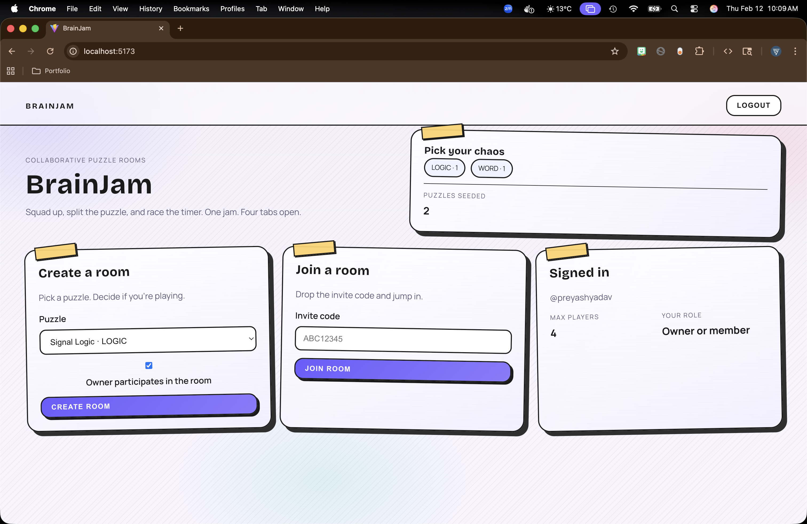
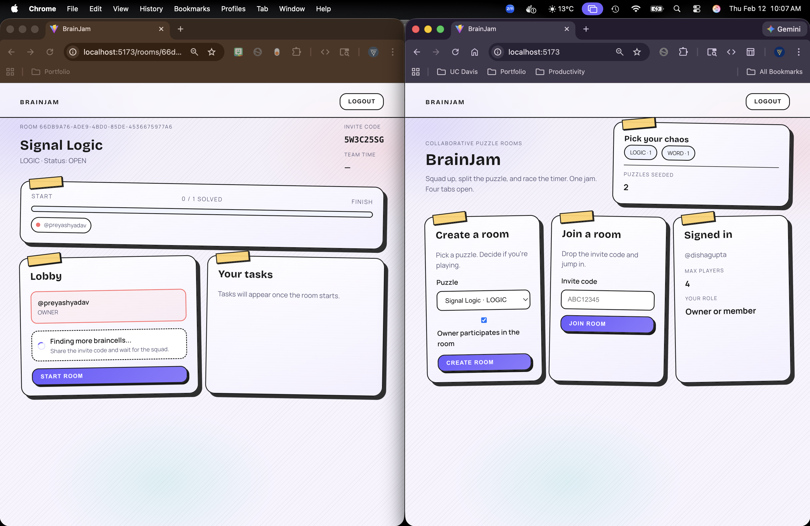
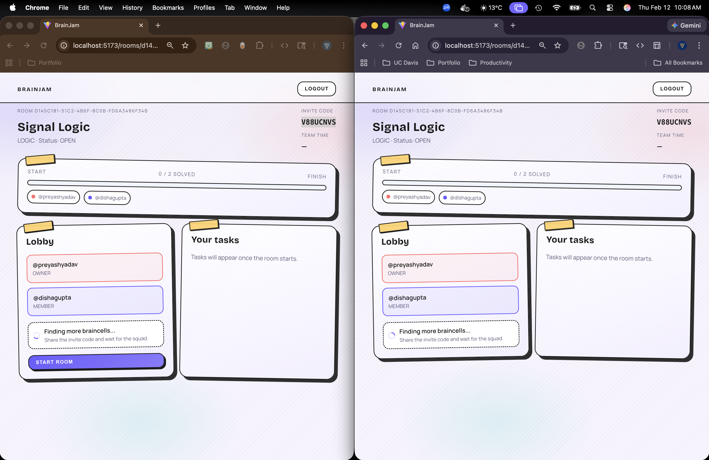
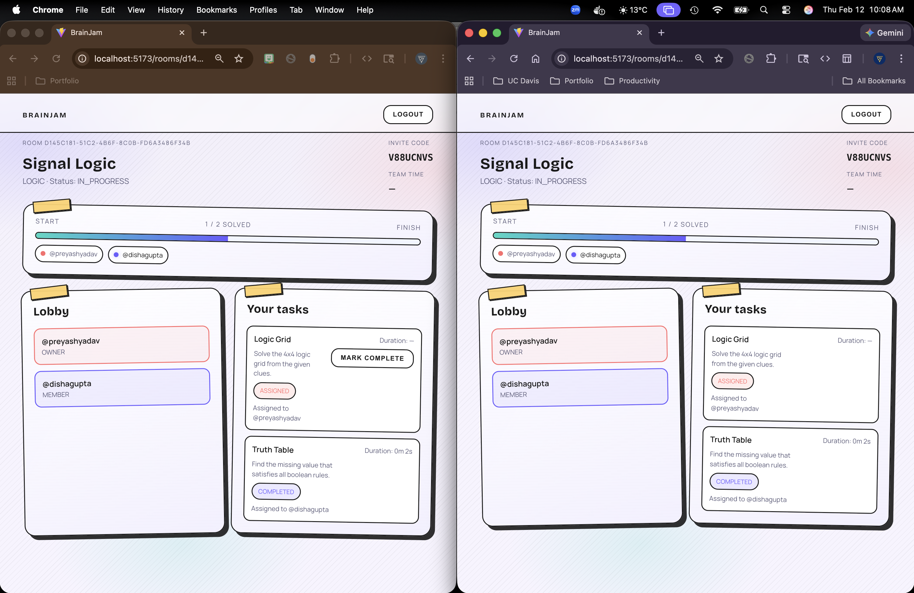
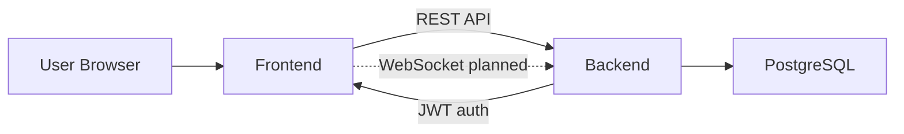

# BrainJam

Collaborative puzzle rooms: create a lobby, invite friends with a code, and tackle a puzzle pack together (2-4 players).

## Tech Stack

- **Frontend**: React + Vite + React Router
- **Backend**: Python + Flask (REST) + SQLAlchemy + Alembic/Flask-Migrate
- **Database**: PostgreSQL
- **Auth**: JWT (Bearer tokens)
- **Dev**: ESLint (frontend), pytest (backend)

## Screenshots






---

# HLD (High-Level Design)

## Architecture



## Key Components

- **Frontend (`frontend/`)**: React SPA (React Router) that calls the backend via `fetch`.
- **Backend (`backend/`)**: Flask app exposing REST endpoints under `/api/*` with consistent JSON error payloads.
- **Database**: Postgres (via `backend/docker-compose.yml`) and SQLAlchemy models + migrations.

## Core Flows

1. **Auth**
   - Register/Login -> backend issues JWT (7-day expiry).
   - Frontend stores JWT locally and uses it for authenticated routes and requests.
2. **Browse puzzles**
   - Frontend queries `/api/puzzles` and `/api/puzzles/genres`.
3. **Create/join room**
   - Create room picks a puzzle pack -> returns a room with `inviteCode`.
   - Join uses invite code -> returns `roomId`, then UI loads the room.

---

# LLD (Low-Level Design)

## Backend Design (Flask)

### Modules

- `backend/app/__init__.py`: app factory, blueprint registration, puzzle seeding on startup.
- `backend/app/models.py`: SQLAlchemy models (users, puzzle packs/tasks, rooms/members/tasks).
- `backend/app/common/`: auth decorator, error types/handlers, request validators.
- `backend/app/auth/routes.py`: register/login + `/api/auth/me`.
- `backend/app/puzzles/routes.py`: puzzle catalog endpoints.
- `backend/app/rooms/routes.py`: create/join/get room (lobby scope).
- `backend/app/realtime/routes.py`: `/ws/...` placeholder.

### Data Model (tables)

- `users`: identity + password hash (Werkzeug), `email`/`username` unique.
- `puzzle_packs`: catalog of packs (slug, genre, difficulty, description, etc).
- `puzzle_tasks`: tasks per pack (prompt, answer optional, order).
- `rooms`: a lobby instance bound to a puzzle pack + owner + invite code.
- `room_members`: users in rooms with a role and ready flag.
- `room_tasks`: planned mapping of room → puzzle tasks (gameplay not implemented yet).

### API Surface

**Health**
- `GET /api/health` → `"OK"`

**Auth**
- `POST /api/auth/register` `{ username, email, password }` → `{ token, user }`
- `POST /api/auth/login` `{ identifier, password }` → `{ token, user }`
- `GET /api/auth/me` (Bearer JWT) → `{ id, username, displayName }`
- `GET /api/me` (Bearer JWT) → compatibility alias of `/api/auth/me`

**Puzzles**
- `GET /api/puzzles/genres` → `string[]`
- `GET /api/puzzles?genre=&difficulty=` → puzzle pack summaries
- `GET /api/puzzles/:slug` → pack summary + `tasks[]`

**Rooms (Lobby)**
- `POST /api/rooms` (Bearer JWT) `{ puzzleId, maxPlayers, ownerParticipates }` → room payload
- `POST /api/rooms/join` (Bearer JWT) `{ inviteCode }` → `{ id }`
- `GET /api/rooms/:id` (Bearer JWT) → room payload
- `GET /api/rooms/:id/tasks` (Bearer JWT) → `[]` (placeholder)

### Auth & Error Handling

- Auth uses `Authorization: Bearer <JWT>`; middleware sets `g.user_id`.
- Errors return a JSON shape: `{ "code": "...", "message": "...", "details": { ... }? }`.

## Frontend Design (React)

### Structure

- `frontend/src/api/client.js`: `apiFetch()` wrapper + base URL via `VITE_API_BASE_URL`.
- `frontend/src/auth/*`: auth context/provider + token persistence.
- `frontend/src/routes/AppRoutes.jsx`: route table with `RequireAuth` protected pages.
- `frontend/src/pages/*`: `Home`, `Register`, `Login`, `PuzzleBrowser`, `CreateRoom`, `JoinRoom`, `Room`, `History`.

### Routing

- Public: `/`, `/register`, `/login`, `/puzzles`
- Auth-required: `/rooms/new`, `/join`, `/rooms/:roomId`, `/history`

---

# Local Development

## Prerequisites

- Node.js (for `frontend/`)
- Python 3.11+ (for `backend/`)
- Docker (recommended for Postgres)

## Database (Postgres)

From `backend/`:

```bash
docker compose up -d
```

## Backend (Flask)

From `backend/`:

```bash
python -m venv .venv
. .venv/bin/activate  # (PowerShell: .\\.venv\\Scripts\\Activate.ps1)
pip install -r requirements.txt

copy .env.example .env  # (Windows)
python run.py
```

Backend runs at `http://localhost:5000` and the API is under `http://localhost:5000/api`.

## Frontend (Vite)

From `frontend/`:

```bash
npm install
npm run dev
```

If your backend is not on `http://localhost:5000`, set:
- `VITE_API_BASE_URL` (example: `http://localhost:5000/api`)

---

# Repo Layout

```text
backend/   Flask API + SQLAlchemy + migrations
frontend/  React SPA (Vite)
docs/      UX/product spec notes
```
